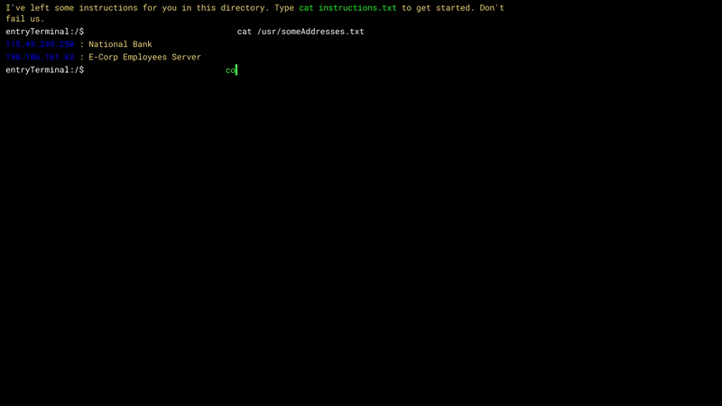
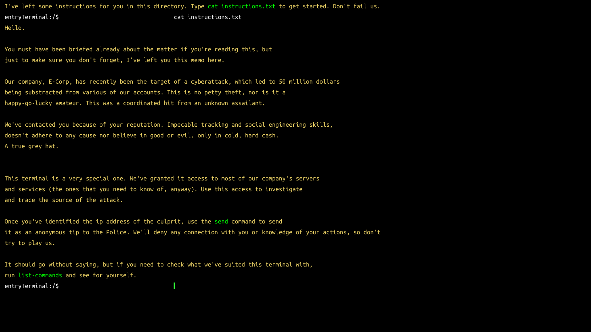
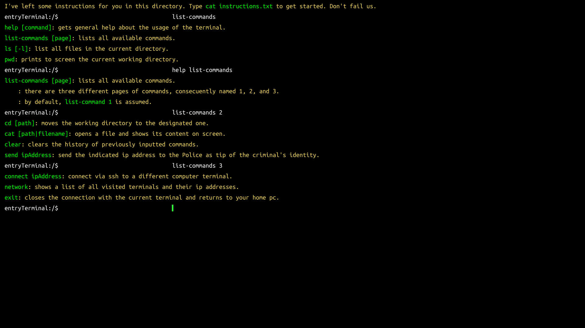
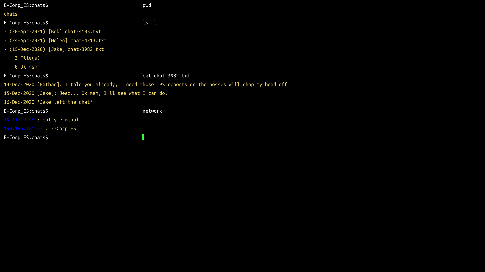

# Codename::GreyHat
A text-based adventure game developed in **Unity** for the [LudumDare 48th GameJam](https://ldjam.com/events/ludum-dare/48). The game was developed for the *Compo* category, meaning it was developed entirely by me in 48 hours.

The original LDJam entry for this game can be found [here](https://ldjam.com/events/ludum-dare/48/codenamegreyhat). This game is also hosted on [itch.io](https://train27.itch.io/codenamegreyhat).

## Screenshots

